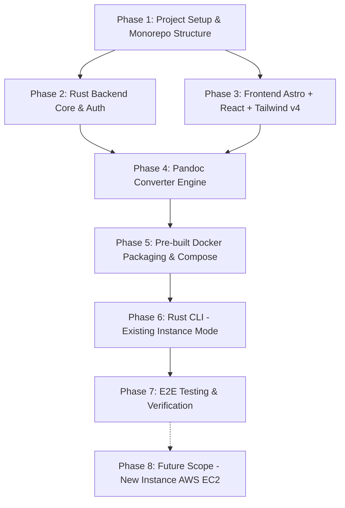

# Implementation Tasks: Disposable Service Workspace (MVP)

Status: Selesai Diimplementasikan (Phase 1 - 7 Complete)  
Dokumen Referensi: [prd.md](file:///Users/mac/projects/disposable-service/prd.md)

---

## 🛠 Keputusan Arsitektur & Tech Stack

- **Backend:** **Rust** (Framework `axum` + `tokio`, JWT auth, in-memory session tracking, Pandoc subprocess wrapper).
- **Frontend:** **Astro 5 + React 19 (Client Side Rendering / React islands)** disajikan sebagai static bundle (SPA/CSR) langsung dari server backend Rust atau reverse proxy ringan.
- **Styling:** **Tailwind CSS v4** (`@tailwindcss/vite`) dikonfigurasi dengan **Airbnb Inspired Design System** (Rausch `#ff385c`, clean white canvas `#ffffff`, ink text `#222222`, 14px soft card corners, 8px inputs/buttons, 1-tier subtle elevation shadow).
- **CLI (Control Plane):** **Rust** (`clap`, `ssh2` untuk koneksi SSH & SFTP).
- **Deployment Mode (MVP):** Prioritas penuh ke mode `--existing` (SSH ke server yang sudah ada). Mode `--new` (AWS EC2) ditandai sebagai fase lanjutan (Phase 8 / Post-MVP).
- **Distribusi Container:** **Pre-built Docker Image** (multi-stage: Rust server binary + Astro build + Pandoc & `pdflatex`) yang siap dipublish ke container registry (e.g. GitHub Container Registry `ghcr.io`).

---

## 📌 Ringkasan Roadmap & Milestone



---

## Phase 1: Inisialisasi Monorepo & Struktur Proyek
*Fokus: Setup Cargo workspace untuk Rust (CLI + Server) dan project frontend Astro.*

- [x] **Task 1.1: Setup Rust Cargo Workspace**
  - Inisialisasi `Cargo.toml` root sebagai workspace:
    - `crates/server`: Aplikasi backend HTTP (Axum).
    - `crates/cli`: Aplikasi CLI kontrol (`clap`).
    - `crates/common`: Tipe data bersama / DTO.
- [x] **Task 1.2: Setup Frontend Astro + React**
  - Inisialisasi direktori `frontend/` menggunakan Astro 5 + React 19.
  - Integrasikan `@tailwindcss/vite` (Tailwind CSS v4).
  - Konfigurasi output mode static build (`dist/`) agar disajikan oleh backend Rust via `tower-http`.
- [x] **Task 1.3: Konfigurasi Linter, Formatter & Git Hygiene**
  - Setup `.gitignore`, `rustfmt.toml`, dan script build terintegrasi.

---

## Phase 2: Rust Backend Core & Authentication (Req 4.2)
*Fokus: Server API, First Access Setup (Claim Single Password), JWT Session, dan Active Sessions Tracker.*

- [x] **Task 2.1: Axum HTTP Server & State Management**
  - Setup Axum server dengan router, middleware CORS, logging (`tracing`), dan graceful shutdown.
  - State struct di Rust (menggunakan `Arc<RwLock<AppState>>`):
    - Status klaim password (`Option<String>` hash password).
    - In-memory active sessions map: token ID / session ID -> metadata (IP Address, User-Agent, login time).
- [x] **Task 2.2: First Access Setup (Req 4.2.1)**
  - Endpoint `GET /api/auth/status`: Mengembalikan status klaim (`is_claimed: bool`) dan autentikasi (`is_authenticated: bool`).
  - Endpoint `POST /api/auth/setup`:
    - Hanya menerima jika belum diklaim (`400 Bad Request` jika sudah diklaim).
    - Hash password menggunakan `argon2`.
    - Set state menjadi *claimed*.
- [x] **Task 2.3: Login & JWT Session Management (Req 4.2.2)**
  - Endpoint `POST /api/auth/login`:
    - Verifikasi password terhadap hash Argon2.
    - Terbitkan JWT dengan masa kedaluwarsa 1 jam (claims: session ID, iat, exp).
    - Simpan session di in-memory tracker (ekstrak client IP dan `User-Agent`).
    - Kirim JWT via cookie `HttpOnly; SameSite=Lax; Path=/`.
  - Extractor autentikasi Axum (`AuthenticatedSession`):
    - Validasi token JWT dari cookie pada rute terproteksi.
    - Kembalikan `401 Unauthorized` jika token tidak ada, tidak valid, atau kedaluwarsa.
- [x] **Task 2.4: Active Sessions & Logout API (Req 4.2.3)**
  - Endpoint `GET /api/sessions`: Mengembalikan daftar sesi aktif (IP, User-Agent, login timestamp).
  - Endpoint `POST /api/auth/logout`: Menghapus sesi dari in-memory tracker dan menghapus cookie auth.

---

## Phase 3: Frontend Astro + React (Tailwind CSS v4 & Airbnb Design System)
*Fokus: Antarmuka modern, warm, humanis, dan konsisten berpedoman pada Airbnb Inspired Design System menggunakan Tailwind CSS v4.*

- [x] **Task 3.1: Token Desain & Fondasi Tailwind CSS v4 (`global.css`)**
  - **Color Palette:**
    - Canvas: `#ffffff`, Surface Soft: `#f7f7f7`, Surface Strong: `#f2f2f2`
    - Brand/Primary (Rausch): `#ff385c`, Active: `#e00b41`, Disabled: `#ffd1da`
    - Text: Ink `#222222`, Body `#3f3f3f`, Muted `#6a6a6a`, Muted-Soft `#929292`
    - Hairline & Borders: `#ebebeb` (soft), `#dddddd` (default), `#c1c1c1` (strong)
    - Semantic Error: `#c13515`, Success: `#008a05`
  - **Typography (Inter font):**
    - Clean weights (400, 500, 600, 700).
  - **Shape & Elevation Tokens:**
    - Border Radii: `sm: 8px` (button/input), `md: 14px` (card/dialog), `full: 9999px` (pill/badge).
    - Shadow tier khas Airbnb: `rgba(0,0,0,0.02) 0 0 0 1px, rgba(0,0,0,0.04) 0 2px 6px, rgba(0,0,0,0.1) 0 4px 8px`.
- [x] **Task 3.2: Layout & Top Navigation Bar (Req 4.2.3)**
  - Top nav: Tinggi 80px (`h-20`), background `#ffffff`, border bottom 1px hairline `#ebebeb`.
  - Brand wordmark "Disposable Workspace" di sisi kiri dengan aksen Rausch.
  - Tab navigasi produk di tengah (Dashboard & Pandoc App) dengan underline indikator aktif 2px ink.
  - Sisi kanan: Active Sessions modal trigger dan tombol Logout.
- [x] **Task 3.3: Auth Pages (Setup & Login) Berbasis Airbnb Surface**
  - Card form terpusat berukuran nyaman dengan padding 32px, radius 14px, dan 1-tier elevation shadow.
  - **Halaman Setup (`/setup`):** Onboarding pembentukan *Single Password* dengan input field bertumpuk rapi dan tombol Rausch.
  - **Halaman Login (`/login`):** Form login minimalis dengan tombol aksi utama Rausch "Sign In".
- [x] **Task 3.4: Dashboard & Active Sessions View (Req 4.2.3)**
  - **App Directory Grid:** Menampilkan kartu layanan ("Pandoc Markdown to PDF") dengan visual bersih, corner radius 14px, badge "App 1 • MVP", dan tombol launch converter.
  - **Active Sessions View (`/sessions` modal):** Tampilan modal rapi berisi daftar sesi aktif (IP address, Browser/OS badge, timestamp login) dengan aksi terminate/logout.

---

## Phase 4: Markdown to PDF Converter App (Req 4.3)
*Fokus: UI input Markdown, backend runner Pandoc + LaTeX, streaming output, dan zero-footprint cleanup.*

- [x] **Task 4.1: Frontend UI Converter (Req 4.3.1 - Airbnb Style)**
  - Komponen React `PandocConverter`:
    - Tab Switcher pill-style (`rounded-full`, soft background): "Paste Markdown" vs "Upload File .md".
    - Input area: Textarea lapang dengan hairline border dan focus 2px ink outline, serta drag-and-drop zone berbintik lembut dengan ikon upload.
    - Tombol aksi utama: Tombol warna Rausch (`#ff385c`) "Convert & Download PDF" dengan state loading/spinner.
    - Info card / parameters preview: Card putih 14px radius dengan 1-tier shadow yang menampilkan preset styling Pandoc (A4, pdflatex, margin 1.8-2cm, font Helvetica Neue).
- [x] **Task 4.2: Rust Backend Pandoc Execution Engine (Req 4.3.2)**
  - Endpoint `POST /api/apps/pandoc/convert` (JSON payload) dan `POST /api/apps/pandoc/convert-upload` (multipart payload).
  - Buat folder kerja terisolasi berbasis UUID di temp directory (`/tmp/pandoc-<uuid>/`).
  - Eksekusi subprocess `pandoc` via `tokio::process::Command` dengan flag sesuai PRD:
    ```bash
    pandoc 'input.md' -o 'output.pdf' \
      --pdf-engine=pdflatex \
      -V papersize=a4 \
      -V geometry:"top=1.8cm, bottom=1.8cm, left=2cm, right=2cm" \
      -V fontsize=10.5pt \
      -V lineheight=1.25 \
      -V colorlinks=true \
      -V linkcolor=navy
    ```
- [x] **Task 4.3: Streaming Delivery & Guaranteed Zero-Footprint Cleanup (Req 4.3.3)**
  - Baca file output PDF dan stream ke HTTP response dengan header `Content-Type: application/pdf` dan `Content-Disposition: attachment; filename="document.pdf"`.
  - Implementasi Drop Guard `TempDirGuard` untuk menjamin direktori temporary langsung dihapus setelah transmisi maupun jika terjadi error.

---

## Phase 5: Pre-built Docker Packaging & Compose Deployment
*Fokus: Image container siap pakai yang memuat binary Rust + Frontend + Pandoc/LaTeX.*

- [x] **Task 5.1: Multi-Stage Dockerfile**
  - **Stage 1 (Frontend):** Node.js 22 alpine build Astro + Tailwind v4 ke static files (`dist`).
  - **Stage 2 (Backend):** Rust 1.85 Debian kompilasi binary server (`disposable-server`).
  - **Stage 3 (Runtime Image):**
    - Base: Debian Bookworm Slim.
    - Instalasi `pandoc`, `texlive-latex-base`, `texlive-fonts-recommended`, `lmodern`.
    - Salin binary server Rust dan static assets frontend.
    - Expose port 80.
- [x] **Task 5.2: Template `docker-compose.yml`**
  - Menunjuk ke image container (`ghcr.io/disposable-workspace/core-service:latest`).
  - Port mapping `80:80`.
  - Resource limits (2 CPU, 2048M RAM).
  - Restart policy `unless-stopped`.
- [x] **Task 5.3: Script Build Pre-built Image**
  - Script build lokal executable `deploy/build-image.sh`.

---

## Phase 6: Rust CLI Control Plane - Existing Instance Mode (Req 4.1)
*Fokus: CLI entry point untuk deployment otomatis via SSH ke server yang sudah ada.*

- [x] **Task 6.1: CLI Command Structure (`clap`)**
  - Binary `disposable-cli`.
  - Support subcommand `deploy` dan `teardown`, serta top-level flag:
    ```bash
    disposable-cli deploy --existing \
      --host <IP_ADDRESS> \
      --port <SSH_PORT: default 22> \
      --user <SSH_USER: default root> \
      --key <PATH_TO_PRIVATE_KEY>
    ```
- [x] **Task 6.2: SSH & SFTP Engine di Rust**
  - Implementasi koneksi SSH menggunakan crate Rust `ssh2`.
  - Autentikasi menggunakan private key (dengan passphrase jika terenkripsi).
- [x] **Task 6.3: Remote Deployment Pipeline (Req 4.1.2)**
  - Embed template `docker-compose.yml` ke dalam binary CLI menggunakan `include_str!`.
  - Transfer file `docker-compose.yml` ke remote directory via SFTP.
  - Eksekusi remote command: cek kesiapan Docker & compose, jalankan `docker compose pull && docker compose up -d`.
- [x] **Task 6.4: Output & Status Display**
  - Spinner dinamis (`indicatif`) selama proses SSH, verifikasi runtime, transfer, dan docker compose.
  - Tampilkan URL akses akhir: `http://<IP_ADDRESS>:80`.

---

## Phase 7: Pengujian, Validasi & Panduan Operasional
*Fokus: Verifikasi alur menyeluruh (E2E) dan dokumentasi penggunaan.*

- [x] **Task 7.1: Integration Testing Backend & Pandoc**
  - Unit test password hashing & verification (`argon2`).
  - Unit test JWT creation, claims validation, dan secret key mismatch.
  - Test suite passing (`cargo test --workspace`).
- [x] **Task 7.2: Build Verification**
  - Build frontend Astro + Tailwind v4 sukses (`npm run build` -> `frontend/dist`).
  - Kompilasi binary release Rust sukses (`disposable-server` dan `disposable-cli`).
- [x] **Task 7.3: Dokumentasi Operasional & Teardown Manual (Req 4.4.1)**
  - `README.md` komprehensif mencakup panduan lokal, build Docker, deployment CLI, dan teardown.

---

## Phase 8 (Post-MVP): Mode New Instance dengan AWS EC2 (Req 4.1.1)
*Fokus: Otomatisasi pembuatan VM on-demand di AWS EC2.*

- [ ] **Task 8.1: Integrasi AWS SDK for Rust (`aws-sdk-ec2`)**
  - Flag `--new --provider aws --region <region>`.
- [ ] **Task 8.2: Provisioning EC2 & Security Group**
  - Buat Security Group membuka Port 22 (SSH) dan Port 80 (HTTP).
  - Launch instance EC2 (Ubuntu 24.04 LTS).
- [ ] **Task 8.3: Wait for Public IP & SSH Handover**
  - Polling status EC2 hingga status `Running` dan mendapatkan Public IP.
  - Handover ke SSH deployment pipeline yang sama dengan mode `--existing`.
